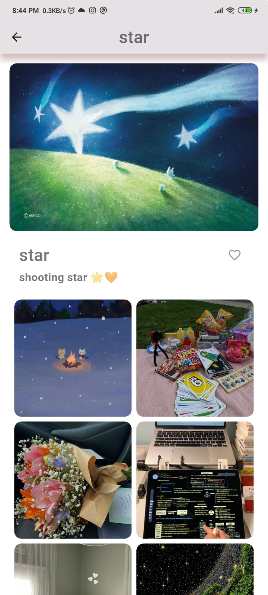

# Inspiration - Visual Discovery App 

<p align="center">
   <!-- Adjust width as needed -->
</p>

A Pinterest-inspired app built with Flutter & Firebase during ITI 1-Month Intensive Flutter Training.

## Team Members
- **Afnan Ali** 
- **Eman Mohamed** 
- **Heba Ahmed**

## Table of Contents
- [Key Features](#key-features)
- [Technical Implementation](#technical-implementation)
- [App Preview](#app-preview)
- [Project Structure](#project-structure)
- [Setup Guide](#setup-guide)
- [Training Context](#training-context)

## Key Features

✅ **Authentication**  
- BLoC-powered login/signup flows
- Email/password authentication
- Form validation

✅ **Core Navigation**  
- Bottom navigation bar
- Protected routes

✅ **User Profile**  
- Basic profile information display
- Profile picture update
- handling dark/light theme

✅ **Additional Features**  
- Image search functionality
- Post creation interface
- using sheard prefrence

## Technical Implementation

**Frontend**:
- Flutter 3.x
- BLoC pattern for all features
- lottie animations

**Backend**:
- Firebase Authentication
- Cloud Firestore
- Cloudinary integration

**Key Packages**:
- `flutter_bloc`: State management
- `firebase_auth`: Authentication
- `cloud_firestore`: Database
- `firebase_core`: Firebase initialization
- `image_picker`: For selecting images
- `flutter_staggered_grid_view`: For creating staggered layouts
- `http`: For making network requests
- `fluttertoast`: For displaying toasts
- `equatable`: For value equality
- `shared_preferences`: For local storage
- `lottie`: For animations
- `cupertino_icons`: iOS style icons

**Frontend**:
- Flutter 3.x
- BLoC pattern for all features
- Custom animations

**Backend**:
- Firebase Authentication
- Cloud Firestore

## App Preview

### Screenshots

#### 🔑 Authentication
<div align="center">
  <div>
  <!-- Login -->
  
  
   <!-- Signup -->
  
  
    <!-- Forget Password -->
  
  
  </div>
  <div>
  
  
  
  
  
  
  </div>
</div>

#### 🏠 Home
<div align="center">
   <div>
  
  
  
  </div>
   <div>
  
  
  
  </div>
</div>

#### 👤 Profile
<div align="center">
   <div>
  
  
  </div>
   <div>
  
  
   </div>
</div>

#### 🔍 Search
<div align="center">
   <div>
  
  
  </div>
   <div>
  
  
  </div>
</div>

#### ❤️ Favourite
<div align="center">
  <div>
    
    
  </div>
  <div>
    
    
  </div>
</div>

#### ⬆️ Upload
<div align="center">
   <div>
  
  
  </div>
   <div>
  
  
  </div>
</div>

#### 🚀 Splash
<div align="center">
  
  
</div>

### Demo Video
[▶ Watch Demo Video](https://drive.google.com/file/d/1Na3smj81MXLbWqtFh2UJq5_1Ptutg_We/preview)


## Project Structure

```
lib/
├── bloc/
│   ├── favourite_bloc/
│   ├── form_bloc/
│   ├── home_bloc/
│   ├── like_bloc/
│   ├── login_bloc/
│   ├── nav_bloc/
│   ├── profile_bloc/
│   ├── search_bloc/
│   ├── signup_bloc/
│   ├── splash_bloc/
│   ├── theme_bloc/
│   └── upload_data/
├── data/
│   ├── models/
│   │   └── auth_repo.dart
│   └── repo/
│       ├── favourite_repo.dart
│       ├── image_model.dart
│       ├── image_repo.dart
│       ├── user_model.dart
│       └── user_repository.dart
├── screens/
│   ├── details_screen.dart
│   ├── favourite_list_screen.dart
│   ├── forget_password_screen.dart
│   ├── heart_icon.dart
│   ├── home_screen.dart
│   ├── login_screen.dart
│   ├── main_navigation.dart
│   ├── profile_screen.dart
│   ├── search_screen.dart
│   ├── signup_screen.dart
│   ├── splash_screen.dart
│   └── upload_screen.dart
├── utils/
│   ├── app_colors.dart
│   ├── app_strings.dart
│   ├── app_text.dart
│   ├── app_themes.dart
│   └── form_validator.dart
├── widget/
│   ├── form_feild.dart
│   ├── grid_view.dart
│   ├── profileinfo.dart
│   ├── profilephoto.dart
│   └── show_toast.dart
├── firebase_options.dart
├── main.dart
└── mainapp.dart

````

## Setup Guide

### Requirements
- Flutter 3.x
- Firebase project
- Cloudinary account (for future features)

### Installation
1. Clone the repository:
   ```bash
   git clone -b feature/login https://github.com/AfnanAli537/iti_final_team3.git
   cd iti_final_team3
   ````

2. Configure Firebase:

   * Add configuration files to `android/app/` and `ios/Runner/`

3. Install dependencies:

   ```bash
   flutter pub get
   ```

4. Run the app:

   ```bash
   flutter run
   ```

## Training Context

Developed during **ITI 1-Month Flutter Intensive Training** (2025) covering:

* BLoC state management
* Firebase integration
* Professional app architecture
* UI/UX best practices


